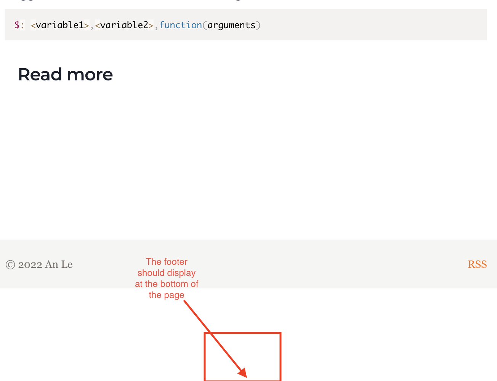

---
title:
  How I fixed gastby's footer  doesn't
  stay in place.
date: "2022-05-18"
description:
  "How I fixed gastby's footer  doesn't
  stay in place."
tags: ["gatsby"]
---

Recently I'd love to write down what I
learn everyday. The purpose for this
kind of activity is that I want to
improve not only my English but also my
expression ability in writing. But sometimes the written lesson was too short and this is when the problem happens.
The footer doesn't stay at the bottom of my page.



For example my layout file is look like this:

```html
  <div className="flex flex-col min-h-[100vh]">
    <header className="flex-none" />
    <main className="flex-1" />
    <footer className="flex-none" />
  </div>
```

As the knowledge page of a human, that thing should work. But Gatsby wraps other components with an unreachable `<div>` with an empty class.
Although I used tailwindCSS to specify `flexbox` for `<div>`. So that I can't access the wrapper of my components.

So I wrapped it within a known class element, such as:

```html
  <div className="site-wrapper">
    <header className="flex-none" />
    <main className="flex-1" />
    <footer className="flex-none" />
  </div>
```

Add the following CSS for given `site-wrapper` class:

```css
// ./style.css
.site-wrapper {
  display: flex;
  min-height: 100vh;
  flex-direction: column;
}
```

Basically, the wrapper (site-wrapper) could expand until filling the viewport (100vh). Thus `<main>` tag can grow free (`flex-1`)
So, the footer will be always at the bottom of the page because it's pushed by the rest of the flexbox column.
