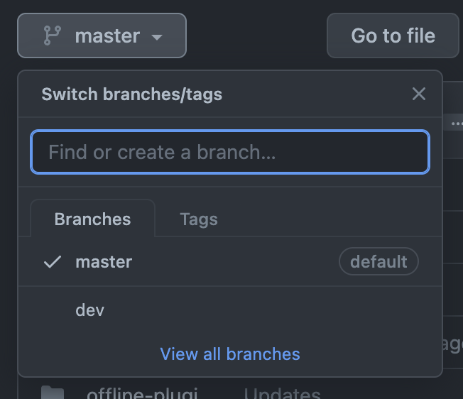

## 1. Install gh-pages

```shell
npm i gh-pages
```

I used **[gh-pages](https://www.npmjs.com/package/gh-pages)** to deploy my repository to github pages.

## 2. Setup Github repository

I created a repository on Github and initialized it locally. Then I checked out into 2 branches: `master` and `dev` (or whaterver).

The branch **`master`** should be set to default and only contains the built source only because **Github Pages** will get the default brach to publish.

The branch **`dev`** should be used to store development source code.

My repository's branches will look like:


## 3. Configure gatsby

In `package.json` I added this following scripts.

```json
./package.json
    //...
    {
    "scripts": {
        //...
        "deploy": "gatsby build --prefix-paths && gh-pages -d public -b master",
    }
}
```

It will build my source code to *public* directory and `gh-pages` will push those files to `master`. Then I config `gastby-config.js`

```js
// in gatsby-config.js
module.exports = {
  pathPrefix: `/`,
}
```

I was struggle with the pathPrefix for a while. I changed it from `'/blogs/'` to `'/'` and it worked.

Add the following strings in plugins array in `gastby-config.js` to support offline functionality (PWA).

```js
// in gatsby-config.js
module.exports = {
    // ...
    plugins: [
    `gatsby-plugin-offline`
    ],
}
```

## 4. [Deploy the blog](#deploy)

```shell
npm run deploy
```

Gatsby blog could be hosted on GitHub Pages at **https://`<username>`.github.io/.**

My github page: [anlt149.github.io](https://anlt149.github.io/)

My repository: [Github](https://github.com/anlt149/anlt149.github.io)
